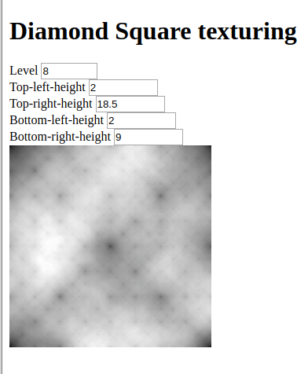

# diamond-square-js
A JavaScript implementation of the Diamond Square height map algorithm

NOTE: Not correctly implemented at the moment!

Try it out [here](https://benwiley4000.github.io/diamond-square-js/).

